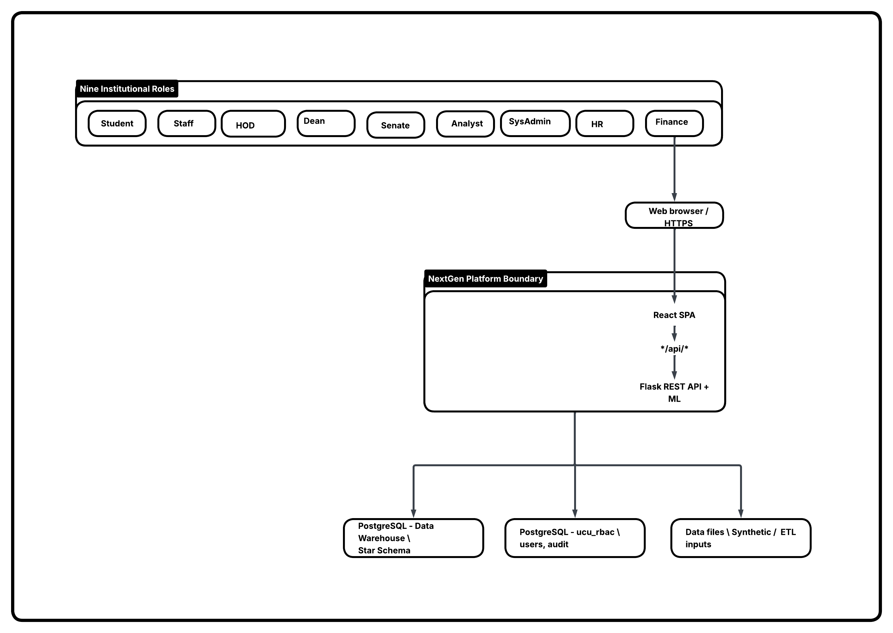
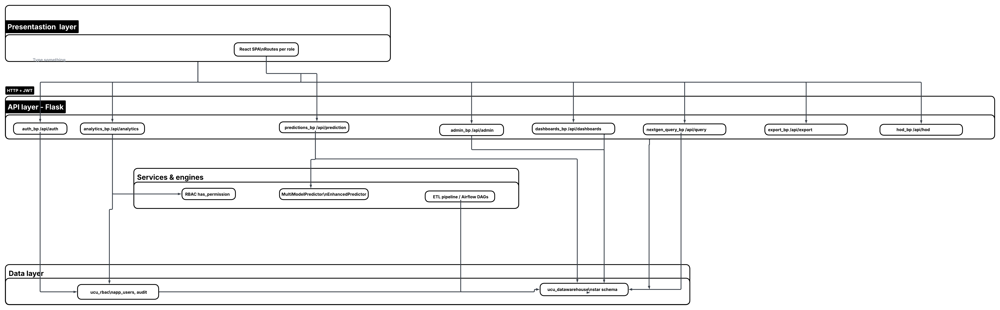
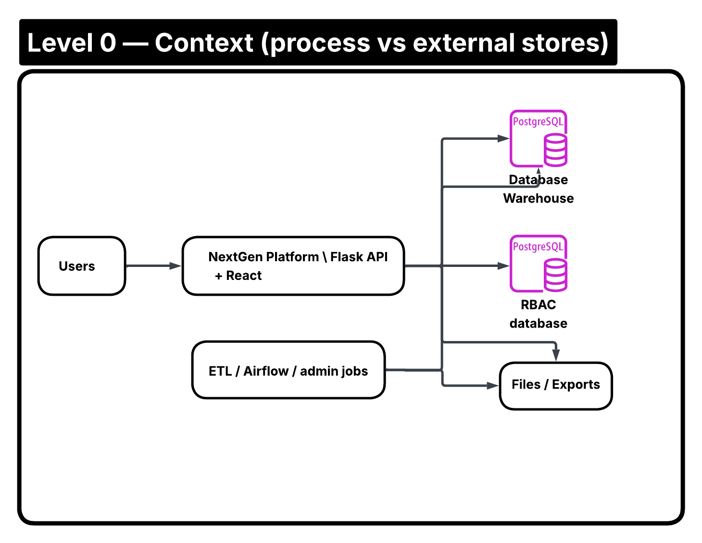
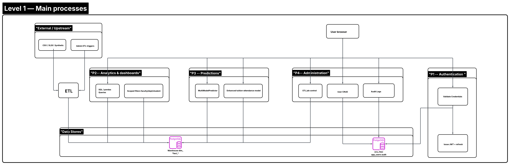

# NextGen Analytics Platform

Analytics, business intelligence (BI), and machine-learning prediction platform for **Uganda Christian University (UCU)**. The system ingests operational and synthetic academic/finance/HR data, lands it in a **PostgreSQL data warehouse** via a **medallion ETL** (bronze → silver → gold), and exposes **JWT-authenticated, RBAC-scoped** REST APIs to a **React 18** single-page application.

**Academic context:** capstone work by the **NextGen Data Architects** team (B.Sc. Data Science and Analytics, UCU).

### What the platform does

| Area | Capabilities (high level) |
|------|---------------------------|
| **ETL & warehouse** | Ingest CSV/XLSX and generated data into **bronze** (Parquet on disk), **silver**, and **gold** layers; load dimensional models into PostgreSQL for reporting. |
| **Analytics** | Faculty-, department-, and program-scoped metrics; finance and tuition; attendance; feeder-school / recruitment; academic risk (e.g. FEX/MEX/FCW-style views). |
| **Dashboards** | Role-aware dashboards, KPI cards, pinned visualizations; analyst **dashboard builder** and page configuration where enabled. |
| **Analyst workspace** | **NextGen Query**: Monaco-based SQL against analyst-safe views, with assigned visualizations and share flows (`api/nextgen_query.py`). |
| **ML** | HTTP APIs for prediction flows backed by `ml_models.py` / `enhanced_predictions.py` (scikit-learn). |
| **Administration** | User management, ETL triggers and history, audit log visibility, system settings in `api/admin.py` and related routes. |
| **HR & org** | HR-specific endpoints (`api/hr.py`), HOD routes (`api/hod.py`), export to Excel/CSV (`api/export.py`). |

---

## Live deployment

| Component | URL / host |
|-----------|------------|
| **Frontend (React SPA)** | [https://nextgen-mis.vercel.app](https://nextgen-mis.vercel.app) |
| **Backend API (Flask)** | [https://nextgen-mis.onrender.com](https://nextgen-mis.onrender.com) |
| **Database** | Managed PostgreSQL on Render (e.g. Frankfurt region in project docs) |

**Browser → API routing in production**

- **Recommended:** Build the frontend with `REACT_APP_API_URL` pointing at the Render API so the SPA calls the backend **directly** over HTTPS; JWTs are sent as `Authorization: Bearer <token>` (cross-origin; CORS allowlists Vercel origins in `backend/app.py`).
- **Alternative:** Rely on Vercel rewrites in `frontend/vercel.json`: `/api/*` → Render (`https://nextgen-mis.onrender.com/api/...`), so `/api` appears same-origin on the Vercel host.

Idle handling, token lifetime, and `DISABLE_SESSION_EXPIRY` alignment are documented in [docs/deployment/PRODUCTION_URLS_AND_SESSIONS.md](docs/deployment/PRODUCTION_URLS_AND_SESSIONS.md).

---

## Technology stack

### Backend

| Layer | Choice | Notes |
|-------|--------|--------|
| Runtime | Python 3.11+ | `Dockerfile` uses `python:3.11-slim`; local dev per README quick start |
| API | Flask 3 | `gunicorn` / `waitress` for production WSGI |
| Auth | `flask-jwt-extended` | Access + refresh tokens; optional long-lived tokens when `DISABLE_SESSION_EXPIRY` is set |
| Data access | SQLAlchemy (<2.1), `psycopg2-binary` | `db_engines.py` pool; pandas for analytics/ETL |
| ETL | Custom pipeline + optional Airflow | `etl_pipeline.py`; DAGs under `airflow/dags/` |
| ML | scikit-learn | `ml_models.py`, `enhanced_predictions.py` |
| Files / parquet | pandas, pyarrow | Bronze layer snapshots on disk under `backend/data/` |

### Frontend

| Layer | Choice | Notes |
|-------|--------|--------|
| UI | React 18 | Create React App (`react-scripts`) |
| Styling / components | Chakra UI, Radix tabs, Tailwind-related tooling | Mixed component library + utility classes |
| Charts | ECharts, Recharts, Plotly | Dashboards and analytics views |
| SQL workspace | Monaco Editor | Analyst “NextGen Query” experience |
| HTTP | Axios | `frontend/src/services/api.js`; dev proxy to Flask `:5000` |

### Infrastructure

| Concern | Tool |
|---------|------|
| API + static hosting (reference) | Render (`render.yaml` Blueprint) |
| Frontend CDN / static | Vercel (`vercel.json` rewrites) |
| Local orchestration | Docker Compose: Postgres 16, Flask backend, phased ETL containers, Airflow web + scheduler, React dev server |

---

## Architecture

Diagram PNGs live in **[`readme-images/`](readme-images/)** at the **repository root** (next to this file) with short ASCII filenames so **local Markdown previews** (VS Code / Cursor) can load them. Narrative text remains in [System-Designs/01-system-context.md](System-Designs/01-system-context.md), [System-Designs/02-architecture.md](System-Designs/02-architecture.md), and [System-Designs/04-data-flow-diagrams.md](System-Designs/04-data-flow-diagrams.md).

**If images still do not show in preview:** open the Command Palette (`Ctrl+Shift+P`) → **Markdown: Change Preview Security Settings** → choose **Disable** (or **Allow insecure content**). Ensure the **folder** opened in the editor is the repo root (`NextGen-Data-Architects-Project`), not a parent path.

**All four figures** (HTML `` for best preview compatibility; GitHub renders these too):

### 1. System context

High-level system boundary: actors (students, staff, admins, external systems) and the UCU NextGen platform as a single system versus external dependencies.



### 2. Logical architecture

Logical tiers and deployment-style view (presentation, API/application services, data & integration, hosting split aligned with Vercel + Render + PostgreSQL).



### 3. Data flow diagrams (DFD-style)

#### Level 0 — context flow

Top-level data flow between external entities and the platform (requests, responses, batch/analytics paths).



#### Level 1 — main processes

Decomposition into main processes (e.g. analytics, ETL, authentication, reporting) and data stores as used in [System-Designs/04-data-flow-diagrams.md](System-Designs/04-data-flow-diagrams.md).



### Quick reference (text)

```
React SPA (Vercel)
       │  HTTPS + JWT (Authorization: Bearer)
       ▼
Flask API (Render) — CORS, JWT, RBAC enforcement in route handlers
       │
       ▼
PostgreSQL — warehouse schemas + RBAC / audit metadata (see docs)
       ▲
       │  loads / transforms
File sources (CSV, XLSX) + synthetic seeds ──► Medallion ETL (bronze → silver → gold → warehouse)
       ▲
       │
Optional: Apache Airflow (scheduled or manual DAG triggers)
```

Separation of concerns (routes vs. ETL vs. RBAC) is summarized in [docs/ARCHITECTURE.md](docs/ARCHITECTURE.md).

---

## Data pipeline (medallion)

1. **Bronze** — Raw-ish extracts (including Parquet under `backend/data/bronze/`), typically keyed by run timestamp in filenames.
2. **Silver** — Cleaned, conformed datasets (see `etl_pipeline.py` and `docker-compose.yml` volume layout for `silver_data`).
3. **Gold / warehouse** — Star-schema–oriented facts and dimensions loaded into PostgreSQL (`setup_databases.py`, SQL under `backend/sql/`) for analytics and dashboards.

ETL can be run **standalone** (`python etl_pipeline.py`), via **Docker Compose** services (`ETL_PHASE=bronze|silver|gold`), or **Airflow** (`airflow/dags/etl_auto_scheduler.py`, `etl_manual_run.py`).

**On-disk layout (typical)**

- **Bronze:** `backend/data/bronze/*.parquet` — append-style snapshot files (timestamps in filenames). Large; often gitignored in real projects; present here for reproducibility demos.
- **Silver / gold:** Docker Compose maps named volumes (`silver_data`, `gold_data`) so phased containers do not clobber host paths unexpectedly.
- **ETL logs:** `backend/logs/` — pipeline run logs; timezone for log line timestamps can follow `ETL_LOG_TZ` (see `docker-compose.yml`, e.g. `Africa/Kampala`).

---

## Data stores (PostgreSQL)

| Database / schema role | Typical name | Used for |
|------------------------|--------------|----------|
| **Warehouse** | e.g. `ucu_datawarehouse` (Compose: `POSTGRES_DB` in `docker-compose.yml`) | Star-schema facts/dimensions, analytics queries, dashboard feeds. |
| **RBAC / application** | Separate DB (e.g. `ucu_rbac` — see [docs/ARCHITECTURE.md](docs/ARCHITECTURE.md)) | `app_users`, permissions, audit trail, dashboard metadata. |
| **Airflow metadata** | `airflow_meta` | Airflow only; created by `postgres-init` on first container boot. |

Connection strings are built in `backend/config/connection.py` from `DATABASE_URL` or discrete `PG_HOST` / `PG_PORT` / `PG_USER` / `PG_PASSWORD` variables. The Render blueprint injects `DATABASE_URL` from the managed PostgreSQL addon.

DDL and warehouse design detail: [System-Designs/05-data-model.md](System-Designs/05-data-model.md), [System-Designs/09-etl-data-warehouse-erd.md](System-Designs/09-etl-data-warehouse-erd.md).

---

## Repository structure

| Path | Purpose |
|------|---------|
| `backend/` | Flask app, ETL, ML, RBAC, cache, audit logging |
| `frontend/` | React SPA, routes, charts, shared UI, API client |
| `airflow/` | DAGs, Airflow plugins, logs mount |
| `docs/` | Deployment, architecture, backend runbooks, credentials references |
| `System-Designs/` | Supplemental ERDs, DFDs, RBAC, API, NFRs (design views aligned with code) |
| `Data Profiling and Analysis/` | Jupyter notebooks and profiling utilities |
| `postgres-init/` | Docker init SQL (e.g. `airflow_meta` database alongside warehouse) |
| `services/` | Helper scripts (e.g. `start_all_services.ps1`) |
| `render.yaml` | Render Blueprint (backend Docker, static frontend build, DB) |
| `docker-compose.yml` | Full local stack |

---

### Backend layout (key files)

```
backend/
├── app.py                  Flask entry point, registers blueprints, KPI/dashboard helpers, large route surface
├── api/
│   ├── auth.py             Login, logout, refresh, profile (JWT)
│   ├── analytics.py        Academic, finance, attendance, recruitment, risk (FEX/MEX/FCW), filters
│   ├── admin.py            Admin: ETL triggers, audit exposure, settings
│   ├── dashboards.py       Dashboard definitions, builder, page config (when imported successfully)
│   ├── predictions.py      ML prediction endpoints
│   ├── export.py           Excel / CSV export
│   ├── hod.py              Head of Department APIs
│   ├── hr.py               HR: leave, payroll, staff
│   ├── user_mgmt.py        Application user CRUD, org linkage
│   └── nextgen_query.py    Read-scoped SQL workspace for analysts
├── config/
│   ├── connection.py       PG / warehouse connection strings from env
│   ├── constants.py        Role lists, KPI/chart/page IDs
│   └── academic.py         Academic calendar / semester rules
├── etl_pipeline.py         Medallion ETL orchestration
├── ml_models.py            Predictor classes used by API
├── rbac.py                 Role enum, resource permissions, `has_permission` helpers
├── db_engines.py           SQLAlchemy engine factory
├── cache.py                In-memory JSON cache (KPIs etc.)
├── audit_log.py            Structured audit events
├── setup_databases.py      Schema bootstrap for local/dev
└── sql/                    DDL / warehouse-oriented SQL scripts
```

Some blueprints in `app.py` are loaded inside `try/except` so a single failing module does not prevent the rest of the API from starting (check server logs if a feature 404s).

### REST API surface (Flask blueprints)

All JSON APIs are under **`/api/...`**. Blueprints (see `backend/api/`) map roughly as follows:

| Prefix / module | Responsibility |
|-----------------|----------------|
| `/api/auth` | Login, logout, refresh, profile (JWT). |
| `/api/analytics` | Academic, finance, attendance, recruitment, risk aggregates (query params for scope). |
| `/api/user-mgmt` | Application users and org fields. |
| `/api/hr`, `/api/hod` | HR and head-of-department workflows. |
| `/api/dashboards`, `/api/dashboard-manager`, `/api/page-config` | Dashboard definitions and builder (when blueprints load). |
| `/api/predictions` | ML prediction endpoints. |
| `/api/export` | File export (Excel/CSV). |
| `/api/admin` | ETL, audit, settings. |
| `/api/query` | NextGen Query / assigned visualizations. |

**Discovery / health:** `GET /api/status` — JSON describing service health; **Render health check** uses `GET /api/user-mgmt/ping` (see `render.yaml`). The Flask app also exposes a JSON document at **`/`** listing entrypoints (useful when browsing the API root).

**Caching:** dashboard KPI bundles and similar hot paths may use `backend/cache.py` (in-memory TTL JSON cache) to reduce repeated warehouse hits; invalidate or tune when schema changes during development.

---

### Frontend layout (conventions)

- **`src/pages/`** — Role-specific and feature pages (student, HOD, HR, finance, FEX analytics, admin, predictions, NextGen Query, etc.).
- **`src/components/`** — `ui/`, `shared/`, `charts/`, `admin/`, plus dashboard renderers.
- **`src/config/`** — `routes.js`, `roles.js`, `kpis.js`: single place for navigation and RBAC alignment with backend constants.
- **`src/context/`** — e.g. `AuthContext` for session and token refresh behaviour.
- **`src/services/api.js`** — Centralized API calls (prefer this over ad hoc axios in pages).

---

## Authentication and authorization

| Mechanism | Detail |
|-----------|--------|
| **Transport** | JWT access token (default ~60 min when session expiry enabled) + refresh token (~12 hours); stored client-side; refresh before expiry where implemented |
| **Authorization** | Role-based (`rbac.py`); backend checks permissions on analytics, admin, dashboards, and SQL workspace routes; frontend uses `utils/rbac.js` + `config/` for UX and redirects |
| **Audit** | `audit_log.py` records sensitive actions (see admin and auth flows) |

**Application roles** (abridged; see `rbac.py` and docs for full resource matrix):

| Role | Typical access |
|------|----------------|
| `sysadmin` | Full operational access, user management |
| `analyst` | Cross-domain analytics, SQL workspace, dashboard builder |
| `dean` | Faculty-scoped dashboards and analytics |
| `hod` | Department-scoped dashboards, staff views |
| `staff` | Course-linked student data |
| `hr` | HR analytics, leave, staff |
| `finance` | Fees, payments, revenue views |
| `senate` | Institution-level read-only dashboards |
| `student` | Own academic record |

---

## Quick start (local)

**Prerequisites:** Python 3.11+, Node 18+, PostgreSQL 14+ (or Docker).

### Option A — Host Python + Node (matches most docs)

```bash
# 1. Database + warehouse
cd backend
pip install -r requirements.txt
python setup_databases.py      # creates schemas / seeds base structure
python etl_pipeline.py         # populate medallion → warehouse paths as configured
python app.py                  # http://localhost:5000

# 2. Frontend (separate terminal)
cd frontend
npm install
npm start                      # http://localhost:3000 (proxies API to :5000 per package.json)
```

**Sample application accounts** after `setup_databases.py` (change in production):

| Username | Password | Role |
|----------|----------|------|
| `admin` | `admin123` | sysadmin |
| `analyst` | `analyst123` | analyst |
| `hr` | `hr123` | hr |
| `finance` | `finance123` | finance |

### Option B — Docker Compose

From the repo root:

```bash
docker compose up --build
```

Services include Postgres, backend on port **5000**, frontend on **3000**, and Airflow UI on **8080** (see `docker-compose.yml` for exact service names, volumes, and `ETL_PHASE` one-shot ETL containers).

**Compose port map (host)**

| Host port | Service |
|-----------|---------|
| 5432 | PostgreSQL |
| 5000 | Flask API |
| 3000 | React (dev server in container) |
| 8080 | Airflow web UI |

---

## Development workflow

| Task | Command / location |
|------|---------------------|
| **Backend install** | `cd backend && pip install -r requirements.txt` |
| **Frontend install** | `cd frontend && npm install` |
| **Frontend lint** | `npm run lint` / `npm run lint:fix` |
| **Frontend format** | `npm run format` / `npm run format:check` |
| **Backend run (Windows)** | `waitress` or `python app.py` per [docs/backend/RUNNING.md](docs/backend/RUNNING.md) |
| **Proxy in Docker** | Frontend container uses `PROXY_TARGET=http://backend:5000` for `/api` (see `docker-compose.yml` + `frontend/setupProxy.js`). |

Use a **`.env`** in `backend/` and `frontend/` for local secrets (never commit real production keys). The frontend reads `REACT_APP_*` variables **at build time** for production bundles.

---

## Deployment (Render / Vercel)

Step-by-step: [docs/deployment/RENDER_DEPLOYMENT.md](docs/deployment/RENDER_DEPLOYMENT.md).

**Core production environment variables (representative)**

| Variable | Purpose |
|----------|---------|
| `DATABASE_URL` | Render-injected PostgreSQL URL for backend |
| `SECRET_KEY` | Flask session / signing |
| `JWT_SECRET_KEY` | JWT signing |
| `FRONTEND_URL` | Extra allowed CORS origin (e.g. `https://nextgen-mis.vercel.app`) |
| `FRONTEND_URLS` | Optional comma-separated extra origins (preview deploys) |
| `DISABLE_SESSION_EXPIRY` | Backend: `0` = short-lived tokens (production); `1` = long-lived JWTs (demo only) |
| `REACT_APP_API_URL` | Frontend **build-time**: base URL for axios (e.g. Render API) |
| `REACT_APP_DISABLE_SESSION_EXPIRY` | Frontend: align idle/session behaviour with backend |

Health check for Render: `/api/user-mgmt/ping` (see `render.yaml`).

---

## Documentation index

| Document | Content |
|----------|---------|
| [docs/ARCHITECTURE.md](docs/ARCHITECTURE.md) | Module map, frontend/backend boundaries, config sources |
| [docs/deployment/RENDER_DEPLOYMENT.md](docs/deployment/RENDER_DEPLOYMENT.md) | Render Blueprint deploy |
| [docs/backend/RUNNING.md](docs/backend/RUNNING.md) | Running backend locally |
| [docs/deployment/PRODUCTION_URLS_AND_SESSIONS.md](docs/deployment/PRODUCTION_URLS_AND_SESSIONS.md) | CORS, JWT, idle timeout |
| [docs/mds/LOGIN_CREDENTIALS.md](docs/mds/LOGIN_CREDENTIALS.md) | Login formats for seeded users |
| [System-Designs/README.md](System-Designs/README.md) | Index of system-design artifacts (ERD, DFD, RBAC, API, NFRs) |

Design docs in `System-Designs/` are **aligned with the codebase** (`backend/`, `frontend/`, `render.yaml`, `backend/rbac.py`); use them for ERD-level detail beyond this README.

---

## Contributors

Core team — **NextGen Data Architects** (B.Sc. Data Science and Analytics, UCU). GitHub profiles match `backend/etl_seeds/admin_settings.json` (`about.developers[].githubHandle`).

- [Emmanuel Nsubuga](https://github.com/Cemputus)
- [Guloba Emmanuel Edube](https://github.com/Edube20Emmanuel)
- [Enoch Asingwiire](https://github.com/asingwiireenoch)

**Support / contact email** : [ensubuga019@gmail.com](mailto:ensubuga019@gmail.com)

---

## Security reminders for operators

- Rotate **`SECRET_KEY`**, **`JWT_SECRET_KEY`**, and database credentials for any long-lived deployment; never use Compose defaults on the public internet.
- Keep **`DISABLE_SESSION_EXPIRY=0`** on the API in production unless you explicitly need long-lived JWTs for a controlled demo.
- Restrict who can run **NextGen Query** and **admin ETL triggers**; both can touch sensitive data or load the warehouse.
- Review **CORS** (`FRONTEND_URL` / `FRONTEND_URLS`) whenever you add a new frontend origin (preview URLs, custom domains).

---

## License and usage

This repository supports academic and demonstration deployments. Review environment variables and credentials before any production use; rotate secrets and disable default passwords outside local development.
