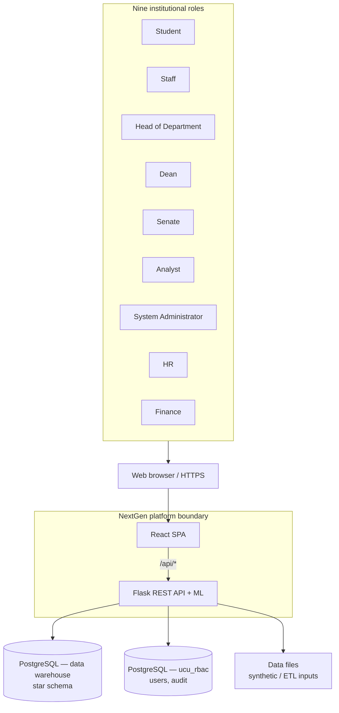

# 01 — System Context

The **NextGen / UCU Data Engineering analytics platform** sits between institutional users and analytical data. It provides dashboards, reporting, predictive analytics, and administrative tooling over a PostgreSQL-backed data warehouse, with optional ETL orchestration.

## Context diagram

*Roles match `backend/rbac.py` `Role` enum and `frontend/src/config/roles.js`.*

*Note: In production, the SPA may be served from Vercel while the API is on Render; `render.yaml` also defines a static frontend service. Exact hosting follows deployment configuration.*

## Data at the boundary

| Direction | Data type | Description |
|-----------|-----------|-------------|
| **Inbound (users)** | Credentials | Username/password or access-number-based flows; JWT access + refresh tokens after authentication. |
| **Inbound (ETL / admin)** | Files, job triggers | Synthetic or operational datasets; ETL job triggers via admin API. |
| **Outbound (users)** | JSON, files | Dashboard KPIs, analytics aggregates, predictions, exports, profile images. |
| **Stored** | Relational | Warehouse facts/dimensions; RBAC database for users and audit. |

## Related documents

- [Logical architecture](./02-architecture.md)
- [RBAC and security](./06-rbac-security.md)
