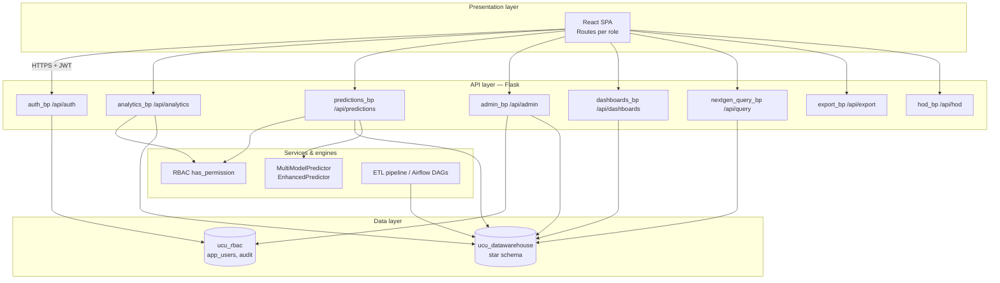
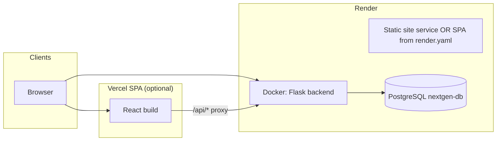

# 02 — Logical Architecture

## Technology stack (as implemented)

| Layer | Technology | Location |
|-------|------------|----------|
| **Presentation** | React (SPA), React Router | `frontend/` |
| **API** | Flask, Flask-JWT-Extended, CORS | `backend/app.py`, `backend/api/*.py` |
| **Business logic** | RBAC, analytics queries, ML predictors, ETL helpers | `backend/rbac.py`, `backend/api/`, `backend/ml_models.py`, `backend/enhanced_predictions.py`, `backend/etl_pipeline.py` |
| **Data** | PostgreSQL (warehouse + RBAC DB) | `config/connection.py`, `backend/sql/` |

*The repository README describes the stack as Flask + React + PostgreSQL; there is no FastAPI service in this project.*

## Logical architecture

## Major components

| Component | Responsibility |
|-----------|----------------|
| **Auth blueprint** | Login, refresh, profile; issues JWT claims including `role`, `student_id`, `faculty_id`, `department_id` where applicable. |
| **Analytics blueprint** | Faculty/department/student/analytics endpoints; filter options; HR mirror queries where configured. |
| **Predictions blueprint** | Standard ML models + tuition–attendance model; scenario analysis; batch predict. |
| **Admin blueprint** | User management, ETL triggers, system status, audit exposure. |
| **Dashboards blueprint** | Role-configurable dashboard pages and shared chart management. |
| **NextGen Query** | Analyst SQL workspace against the warehouse (with safeguards). |
| **Export** | Data export for permitted roles. |

## Deployment architecture

Aligned with [`render.yaml`](../render.yaml) and [README production section](../README.md):

**Environment highlights (Render):** `DATABASE_URL`, `JWT_SECRET_KEY`, `SECRET_KEY`, `FRONTEND_URL`, `DISABLE_SESSION_EXPIRY` — see `render.yaml` and deployment docs.

## Related documents

- [System context](./01-system-context.md)
- [Operations & NFRs](./08-operations-nfrs.md)
- [API map](./07-api-and-integrations.md)
