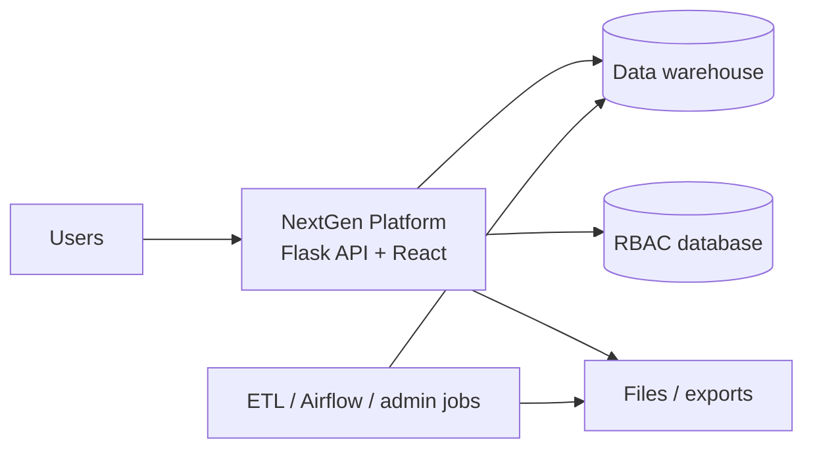
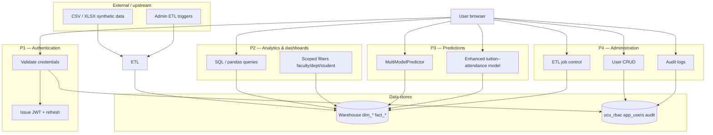

# 04 — Data Flow Diagrams (DFD-style)

## Level 0 — Context (process vs external stores)

## Level 1 — Main processes

## Notation

- **Flows** are HTTPS JSON unless noted (exports may be files).
- **Scope** (own / class / department / faculty) is enforced in API handlers using JWT claims + query filters — see [`backend/rbac.py`](../backend/rbac.py).

## Related documents

- [Data model](./05-data-model.md)
- [API map](./07-api-and-integrations.md)
