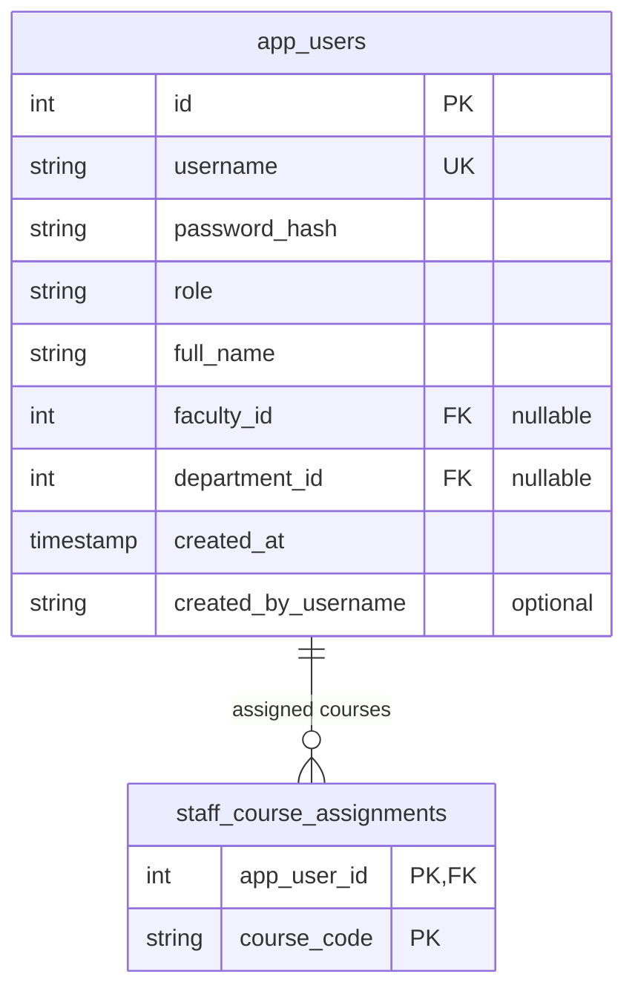
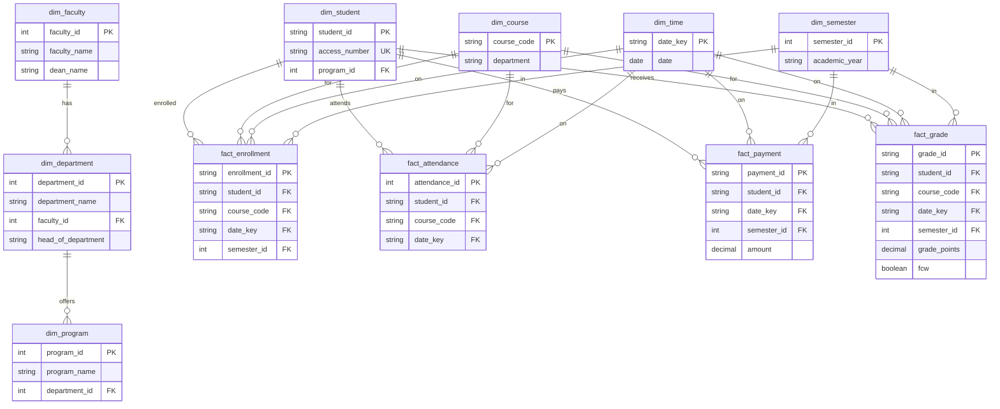

# 05 — Data Model

Persisted data is split across **PostgreSQL databases**: a **data warehouse** (`ucu_datawarehouse` by convention) for analytics star schema, and **`ucu_rbac`** for application identity, optional profile metadata, and audit. Connection strings are defined in [`backend/config/connection.py`](../backend/config/connection.py). The runtime also maintains **`dim_app_user`** in the warehouse to align warehouse facts with application users created in `app_users` (see [`backend/app.py`](../backend/app.py) `_sync_dim_app_user`).

---

## 1. Identity and RBAC (runtime)

The live login path uses **`app_users`** (created/altered in code), not only the older normalized schema in [`backend/sql/create_rbac_system.sql`](../backend/sql/create_rbac_system.sql).

Additional tables ensured at runtime include **`user_profiles`** (extended profile fields) and **`audit_logs`** inserts from auth flows — see [`backend/api/auth.py`](../backend/api/auth.py).

*Reference schema:* [`create_rbac_system.sql`](../backend/sql/create_rbac_system.sql) defines **`roles`**, **`permissions`**, **`role_permissions`**, **`users`**, **`user_sessions`**, **`audit_logs`**, and **`filter_presets`**. Those tables support a normalized RBAC design; the Flask app primarily enforces access via **JWT claims** and the Python matrix in [`backend/rbac.py`](../backend/rbac.py). *If both exist in an environment, treat `app_users` as the source for app-user login unless migrated otherwise.*

---

## 2. Data warehouse (star schema)

Defined in [`backend/sql/create_data_warehouse.sql`](../backend/sql/create_data_warehouse.sql). Dimensions describe **who** (student, program, department, faculty), **what** (course), and **when** (time, semester); facts capture **enrollment**, **attendance**, **payments**, and **grades**.

**Warehouse bridge:** **`dim_app_user`** mirrors application users for analytics that join operational identity to facts (created in [`backend/app.py`](../backend/app.py)).

---

## Related documents

- [Data flow](./04-data-flow-diagrams.md)
- [RBAC and security](./06-rbac-security.md)
