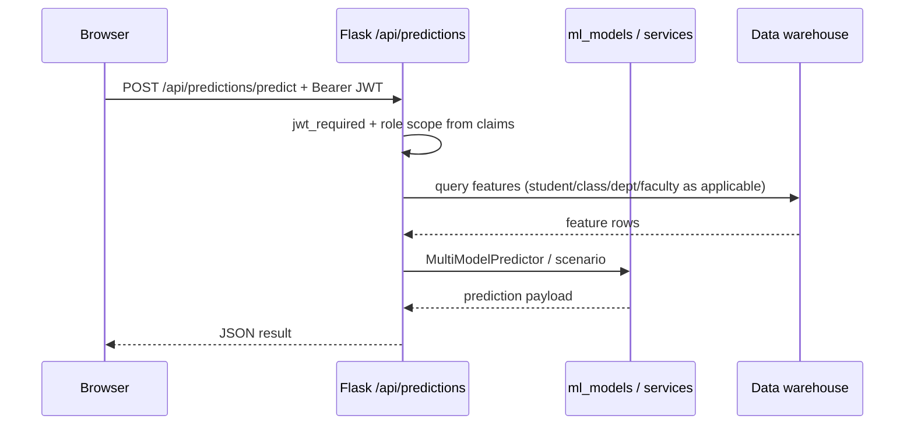

# 07 — API and Integrations

The backend is a **Flask** application. Some endpoints are registered via **Blueprints** under `backend/api/`; others are declared **inline** on the main `app` object in [`backend/app.py`](../backend/app.py). All are **JSON-over-HTTPS** unless returning files (e.g. export).

---

## Route groups (high level)

| Prefix / module | Purpose | Typical consumers |
|-----------------|---------|-------------------|
| **`/api/auth`** (`auth_bp`) | Login, refresh, profile, optional profile photo, client state | SPA |
| **`/api/analytics`** (`analytics_bp`) | Scoped analytics: faculty, department, student, FEX, recruitment, high-school, academic risk, HR, finance, filters | Dashboards by role |
| **`/api/dashboards`**, **`/api/dashboard-manager`**, **`/api/page-config`** (`dashboards.py`) | Saved dashboards, manager swap/remove, per-page config | Analyst, sysadmin |
| **`/api/predictions`** (`predictions_bp`) | Model status, predict, scenarios, batch, tuition–attendance–performance | All roles that see predictions |
| **`/api/export`** (`export_bp`) | Excel / PDF export | Roles with export permission |
| **`/api/admin`** (`admin_bp`) | Ping, settings, ETL run, audit logs, dim/app-user diagnostics, server time | Sysadmin |
| **`/api/query`** (`nextgen_query_bp`) | NextGen Query: execute SQL, assigned visualizations, feedback | Analyst, assigned targets |
| **`/api/dashboard/*`** (in `app.py`) | Aggregated stats, charts, MEX/FEX, tuition trends, `predict-performance` | JWT-protected dashboards |
| **`/api/user-mgmt/*`**, **`/api/sysadmin/*`**, **`/api/admin/users`** (in `app.py`) | User CRUD, faculties, departments, password reset | Sysadmin |
| **`/api/hod/*`** (in `app.py`; mirror routes also exist in [`api/hod.py`](../backend/api/hod.py)) | Department courses, staff in department, staff–course assignments | HOD |
| **`/api/hr/*`** (in `app.py`) | Staff list, HR payroll/leave endpoints | HR, staff (self-service where implemented) |
| **`/api/report/generate`** | Report generation | Senate, analyst, etc. |
| **`/api/status`** | health / connectivity | Operations, load balancers |

Blueprint `url_prefix` values are defined in the respective files under [`backend/api/`](../backend/api/).

---

## Integrations

- **PostgreSQL:** primary data store (warehouse + RBAC).
- **Browser SPA:** hosted separately (e.g. Vercel) with `REACT_APP_API_URL` pointing at the API ([`render.yaml`](../render.yaml)).
- **ETL:** triggered from admin (`POST /api/admin/run-etl` and related) and optional schedulers documented in deployment docs; not a separate microservice in this repo.

---

## Sequence: login

```mermaid
sequenceDiagram
    participant U as Browser
    participant API as Flask /api/auth
    participant RB as ucu_rbac (app_users)

    U->>API: POST /api/auth/login {identifier, password}
    API->>RB: SELECT app_users by username
    RB-->>API: row + password_hash
    API->>API: check_password_hash
    API-->>U: 200 {access_token, refresh_token, role, user}
    Note over U: Store tokens; Authorization Bearer on subsequent calls
```

---

## Sequence: prediction (scoped)



---

## Related documents

- [Data flow](./04-data-flow-diagrams.md)
- [RBAC](./06-rbac-security.md)
- [Operations](./08-operations-nfrs.md)
