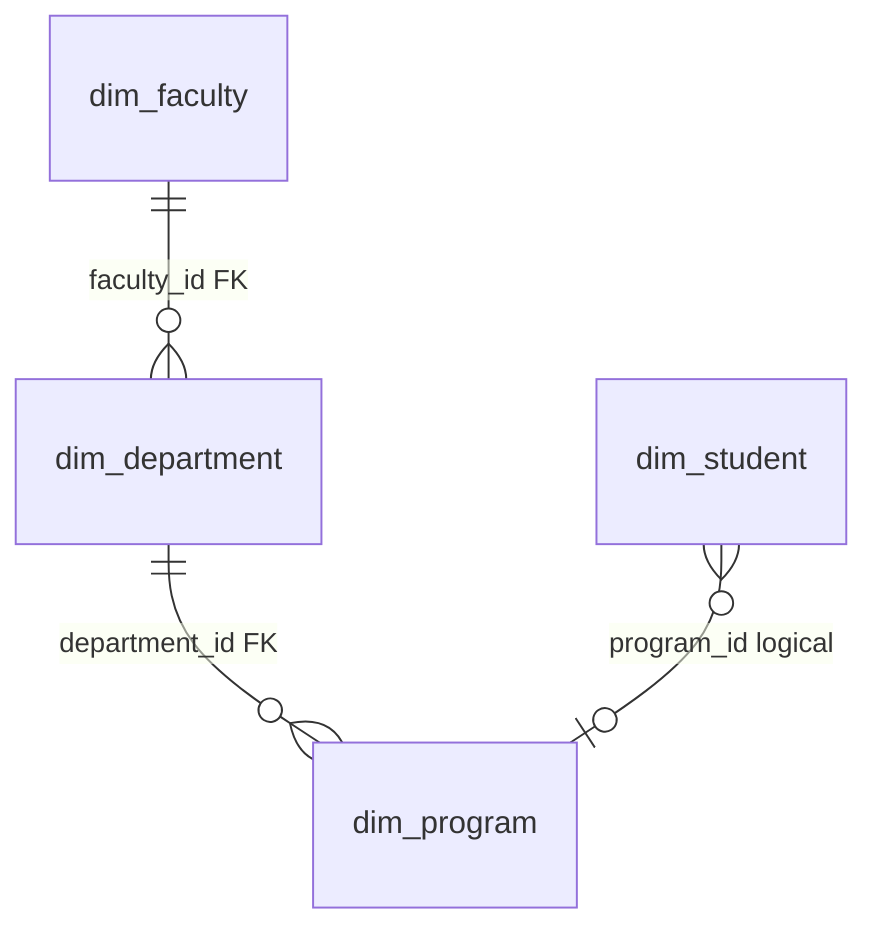
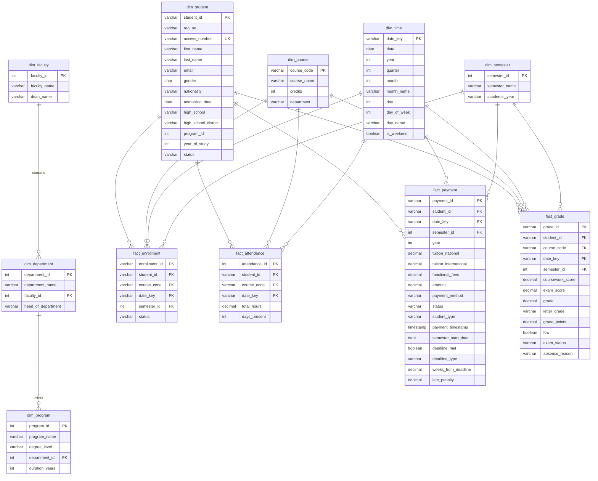
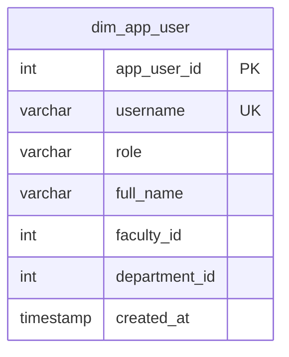
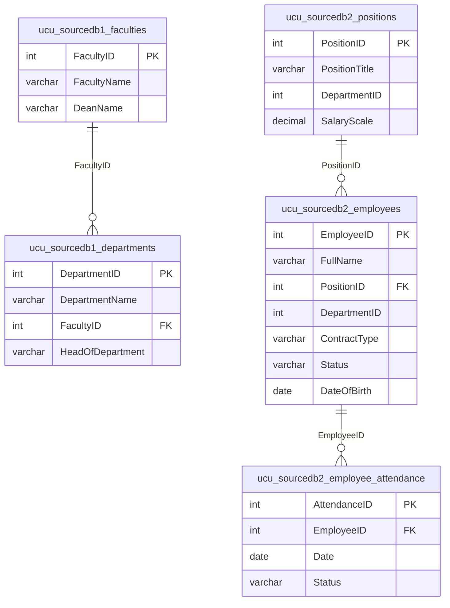

# ERD — ETL / Data Warehouse (`ucu_datawarehouse`)

This document is derived from [`backend/sql/create_data_warehouse.sql`](../backend/sql/create_data_warehouse.sql), [`backend/sql/create_analytical_views.sql`](../backend/sql/create_analytical_views.sql), [`backend/sql/analyst_views.sql`](../backend/sql/analyst_views.sql), [`backend/sql/hr_admin_warehouse_schemas.sql`](../backend/sql/hr_admin_warehouse_schemas.sql), and runtime DDL for **`dim_app_user`** in [`backend/app.py`](../backend/app.py). Operational **source** databases used by ETL are summarized at the end ([`create_source_db1.sql`](../backend/sql/create_source_db1.sql), [`create_source_db2.sql`](../backend/sql/create_source_db2.sql)).

---

## 1. Overview

| Area | Description |
|------|-------------|
| **Star schema** | Dimensions (`dim_*`) and facts (`fact_*`) for academic analytics (enrollment, attendance, payment, grades). |
| **Referential integrity** | Foreign keys exist from facts → dimensions, and `dim_department` → `dim_faculty`, `dim_program` → `dim_department`. **`dim_student.program_id`** matches `dim_program.program_id` but is **not declared as an FK** in the DDL. |
| **Analytical views** | `v_*` and `view_*` — no extra storage; join and aggregate star-schema tables. |
| **Application bridge** | **`dim_app_user`** — mirrors `ucu_rbac.app_users` for analytics that relate operational logins to the warehouse. |
| **HR mirror (schemas)** | **`ucu_sourcedb1`**, **`ucu_sourcedb2`** — PascalCase tables used by HR analytics queries inside the warehouse database ([`hr_admin_warehouse_schemas.sql`](../backend/sql/hr_admin_warehouse_schemas.sql)). |

---

## 2. Star schema — entity relationship (Mermaid)

### 2.1 Dimensions and hierarchy

### 2.2 Full star schema (dimensions + facts)

Relationship notes:

- **`dim_course.department`** is a **name string**, not a FK to `dim_department` (denormalized for flexibility).
- **`dim_student.program_id`** → **`dim_program.program_id`** is **logical** (no FK in SQL).

### Star Schema Relationships (Dimensions + Facts)
| Relationship | Join verb | Join keys (source → target) | Connection type |
|---|---|---|---|
| `dim_faculty` → `dim_department` | has | `dim_department.faculty_id` → `dim_faculty.faculty_id` | FK (declared) |
| `dim_department` → `dim_program` | offers | `dim_program.department_id` → `dim_department.department_id` | FK (declared) |
| `dim_student` → `dim_program` | studies in | `dim_student.program_id` → `dim_program.program_id` | Logical (no FK declared) |
| `fact_enrollment` → dimensions | enrolls | `fact_enrollment.student_id` → `dim_student.student_id` `fact_enrollment.course_code` → `dim_course.course_code` `fact_enrollment.date_key` → `dim_time.date_key` `fact_enrollment.semester_id` → `dim_semester.semester_id` | Fact foreign keys (star joins) |
| `fact_attendance` → dimensions | attends | `fact_attendance.student_id` → `dim_student.student_id` `fact_attendance.course_code` → `dim_course.course_code` `fact_attendance.date_key` → `dim_time.date_key` | Fact foreign keys (star joins) |
| `fact_payment` → dimensions | pays | `fact_payment.student_id` → `dim_student.student_id` `fact_payment.date_key` → `dim_time.date_key` `fact_payment.semester_id` → `dim_semester.semester_id` | Fact foreign keys (star joins) |
| `fact_grade` → dimensions | receives | `fact_grade.student_id` → `dim_student.student_id` `fact_grade.course_code` → `dim_course.course_code` `fact_grade.date_key` → `dim_time.date_key` `fact_grade.semester_id` → `dim_semester.semester_id` | Fact foreign keys (star joins) |

---

## 3. Column-level reference (authoritative DDL)

### 3.1 `dim_faculty`

| Column | Type | Notes |
|--------|------|--------|
| `faculty_id` | INT | PK |
| `faculty_name` | VARCHAR(200) | |
| `dean_name` | VARCHAR(100) | |

### 3.2 `dim_department`

| Column | Type | Notes |
|--------|------|--------|
| `department_id` | INT | PK |
| `department_name` | VARCHAR(200) | |
| `faculty_id` | INT | FK → `dim_faculty(faculty_id)` ON DELETE CASCADE |
| `head_of_department` | VARCHAR(100) | |

**Indexes:** `idx_dim_department_faculty`, `idx_dim_department_name`.

### 3.3 `dim_program`

| Column | Type | Notes |
|--------|------|--------|
| `program_id` | INT | PK |
| `program_name` | VARCHAR(200) | |
| `degree_level` | VARCHAR(50) | |
| `department_id` | INT | FK → `dim_department(department_id)` ON DELETE CASCADE |
| `duration_years` | INT | |

**Indexes:** `idx_dim_program_department`, `idx_dim_program_name`.

### 3.4 `dim_student`

| Column | Type | Notes |
|--------|------|--------|
| `student_id` | VARCHAR(20) | PK |
| `reg_no` | VARCHAR(50) | |
| `access_number` | VARCHAR(10) | UNIQUE |
| `first_name`, `last_name` | VARCHAR(50) | |
| `email` | VARCHAR(100) | |
| `gender` | CHAR(1) | |
| `nationality` | VARCHAR(50) | |
| `admission_date` | DATE | |
| `high_school` | VARCHAR(200) | Feeder / recruitment analytics |
| `high_school_district` | VARCHAR(100) | |
| `program_id` | INT | *Logical* link to `dim_program`; not an FK in DDL |
| `year_of_study` | INT | |
| `status` | VARCHAR(50) | |

**Indexes:** name, email, `access_number`, `reg_no`, `high_school`, `program_id`, `status`.

### 3.5 `dim_course`

| Column | Type | Notes |
|--------|------|--------|
| `course_code` | VARCHAR(20) | PK |
| `course_name` | VARCHAR(100) | |
| `credits` | INT | |
| `department` | VARCHAR(50) | Department **name** (not `department_id`) |

**Index:** `idx_dim_course_department`.

### 3.6 `dim_time`

| Column | Type | Notes |
|--------|------|--------|
| `date_key` | VARCHAR(8) | PK (typical `YYYYMMDD`) |
| `date` | DATE | |
| `year`, `quarter`, `month` | INT | |
| `month_name` | VARCHAR(20) | |
| `day`, `day_of_week` | INT | |
| `day_name` | VARCHAR(20) | |
| `is_weekend` | BOOLEAN | |

**Indexes:** `idx_dim_time_date`, `idx_dim_time_year_month`.

### 3.7 `dim_semester`

| Column | Type | Notes |
|--------|------|--------|
| `semester_id` | INT | PK |
| `semester_name` | VARCHAR(50) | |
| `academic_year` | VARCHAR(20) | |

**Index:** `idx_dim_semester_academic_year`.  
**Seed data:** `INSERT` for semesters Fall 2023–Spring 2025 (see end of `create_data_warehouse.sql`).

### 3.8 `fact_enrollment`

| Column | Type | FK |
|--------|------|-----|
| `enrollment_id` | VARCHAR(20) | PK |
| `student_id` | VARCHAR(20) | → `dim_student` |
| `course_code` | VARCHAR(20) | → `dim_course` |
| `date_key` | VARCHAR(8) | → `dim_time` |
| `semester_id` | INT | → `dim_semester` |
| `status` | VARCHAR(20) | |

### 3.9 `fact_attendance`

| Column | Type | FK |
|--------|------|-----|
| `attendance_id` | SERIAL | PK |
| `student_id` | VARCHAR(20) | → `dim_student` |
| `course_code` | VARCHAR(20) | → `dim_course` |
| `date_key` | VARCHAR(8) | → `dim_time` |
| `total_hours` | DECIMAL(10,2) | |
| `days_present` | INT | |

### 3.10 `fact_payment`

| Column | Type | FK |
|--------|------|-----|
| `payment_id` | VARCHAR(20) | PK |
| `student_id` | VARCHAR(20) | → `dim_student` |
| `date_key` | VARCHAR(8) | → `dim_time` |
| `semester_id` | INT | → `dim_semester` |
| `year` | INT | |
| `tuition_national`, `tuition_international` | DECIMAL(15,2) | |
| `functional_fees` | DECIMAL(15,2) | |
| `amount` | DECIMAL(15,2) | |
| `payment_method` | VARCHAR(50) | |
| `status` | VARCHAR(20) | |
| `student_type` | VARCHAR(20) | Default `'national'` |
| `payment_timestamp` | TIMESTAMP | |
| `semester_start_date` | DATE | |
| `deadline_met` | BOOLEAN | Default FALSE |
| `deadline_type` | VARCHAR(50) | |
| `weeks_from_deadline` | DECIMAL(5,2) | |
| `late_penalty` | DECIMAL(15,2) | Default 0 |

**Indexes:** student, date, semester, year, status, timestamp, `deadline_met`, `deadline_type`.

### 3.11 `fact_grade`

| Column | Type | FK |
|--------|------|-----|
| `grade_id` | VARCHAR(64) | PK |
| `student_id` | VARCHAR(20) | → `dim_student` |
| `course_code` | VARCHAR(20) | → `dim_course` |
| `date_key` | VARCHAR(8) | → `dim_time` |
| `semester_id` | INT | → `dim_semester` |
| `coursework_score` | DECIMAL(5,2) | NOT NULL |
| `exam_score` | DECIMAL(5,2) | |
| `grade` | DECIMAL(5,2) | NOT NULL |
| `letter_grade` | VARCHAR(5) | NOT NULL |
| `grade_points` | DECIMAL(3,2) | Also added via `ALTER TABLE ... IF NOT EXISTS` |
| `fcw` | BOOLEAN | Default FALSE (coursework weight / risk) |
| `exam_status` | VARCHAR(10) | e.g. MEX, FEX |
| `absence_reason` | VARCHAR(200) | |

**Indexes:** student, course, date, semester, grade, `exam_status`, `(student_id, semester_id)`.

---

## 4. `dim_app_user` (runtime, data warehouse)

Created by `_ensure_dim_app_user_table` in [`backend/app.py`](../backend/app.py). Used to align **application users** with warehouse reporting. **No FK** to `dim_faculty` / `dim_department` in DDL; `faculty_id` and `department_id` are nullable integers for filtering and joins.

**Indexes:** `username`, `role`, `faculty_id`, `department_id`.

---

## 5. HR mirror schemas (same PostgreSQL instance / warehouse DB)

Applied by [`hr_admin_warehouse_schemas.sql`](../backend/sql/hr_admin_warehouse_schemas.sql) (see also `hr_warehouse_mirror.py`). Column names are **PascalCase** in quoted identifiers to match backend HR SQL.

*Note:* `ucu_sourcedb2.positions.DepartmentID` and `employees.DepartmentID` are not FK-linked to `ucu_sourcedb1.departments` in this DDL (cross-schema linkage may be by convention / ETL).

---

## 6. Views (derived; not physical tables)

| View | File | Role |
|------|------|------|
| `v_academic_summary` | `create_analytical_views.sql` | Grades joined to student → program → department → faculty |
| `v_student_risk_summary` | same | FCW / MEX / FEX counts and averages by `student_id` |
| `v_highschool_risk` | same | Aggregates by `high_school` / district |
| `view_analyst_grade` | `analyst_views.sql` | Wide grade view for scoped dashboards |
| `view_fcw_mex_fex_summary` | same | Counts by semester and `exam_status` |
| `view_fcw_mex_fex_by_faculty` | same | FCW/MEX/FEX by faculty and semester |

---

## 7. ETL source systems (reference, not warehouse tables)

For pipeline context, **normalized sources** are defined in:

- **`create_source_db1.sql`** — `faculties`, `departments`, `programs`, `courses`, `lecturers`, `students`, `enrollments`, `grades`, `attendance`, `student_fees`.
- **`create_source_db2.sql`** — HR-style: `positions`, `employees`, `contracts`, `employee_attendance`, `payroll`, `assets`, `suppliers`, `purchase_orders`, `maintenance_records`.

ETL jobs populate **`dim_*` / `fact_*`** (and HR mirror tables) from these sources; exact mappings live in the ETL scripts under `backend/` (not repeated here).

---

## Related documents

- [05 — Data model](./05-data-model.md) (condensed ER)
- [04 — Data flow](./04-data-flow-diagrams.md)
