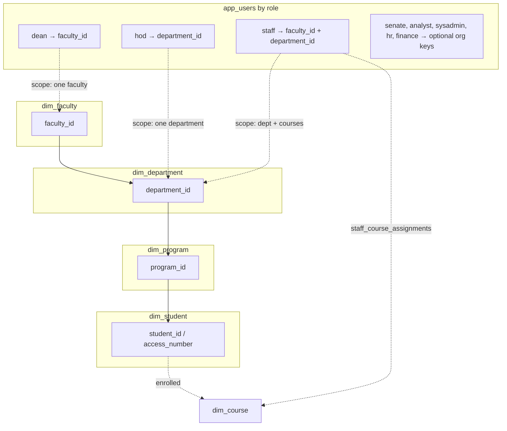
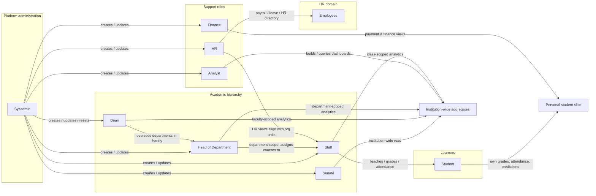

# Domain ERD — Nine Roles, Application Users, and Employees

This is a **conceptual / domain** model for the final-year presentation: it shows **which entities** back each user type, **how employees** fit in, and **how roles relate** through organization structure, data scope, and administration. It is grounded in [`backend/rbac.py`](../backend/rbac.py) (nine `Role` values), [`backend/api/auth.py`](../backend/api/auth.py) (login paths), [`backend/app.py`](../backend/app.py) (`app_users`, `dim_app_user`, `staff_course_assignments`), and the warehouse / HR SQL ([`create_data_warehouse.sql`](../backend/sql/create_data_warehouse.sql), [`hr_admin_warehouse_schemas.sql`](../backend/sql/hr_admin_warehouse_schemas.sql)).

**Important:** There is **not** one database table per role. Non-student roles share **`app_users`** with a **`role`** column; students authenticate against **`dim_student`** (access number) and do not require a row in `app_users`. Relationships labelled **“governance”** or **“scope”** are enforced in the API (JWT claims + queries), not always as foreign keys.

---

## 1. Role → primary persisted entity

| Role | Primary entity (where identity / scope lives) | Scope fields |
|------|-----------------------------------------------|--------------|
| **student** | `dim_student` (warehouse); optional `user_profiles` by access number | `student_id`, program; no `app_users` row for typical access-number login |
| **staff** | `app_users` + `staff_course_assignments` | `faculty_id`, `department_id`; courses taught |
| **hod** | `app_users` | `department_id` (HOD is department-scoped; one HOD per dept enforced in user management) |
| **dean** | `app_users` | `faculty_id` |
| **senate** | `app_users` (or demo JWT) | Often institution-wide read |
| **analyst** | `app_users` | Broad analytics; optional org keys |
| **sysadmin** | `app_users` | User management; ETL; no student record |
| **hr** | `app_users` | HR modules; **employees** are separate tables |
| **finance** | `app_users` | Payment-related views |
| **employees** (HR domain) | `ucu_sourcedb2.employees` (and mirror in warehouse schemas) | `DepartmentID`, `PositionID`; **not** the same table as `app_users` |

**Warehouse bridge:** `dim_app_user` mirrors `app_users` for analytics joins ([`app.py`](../backend/app.py) `_sync_dim_app_user`).

---

## 2. Storage-level ERD (who maps to which tables)

```mermaid
erDiagram
    dim_student {
        varchar student_id PK
        varchar access_number UK
        int program_id "logical -> dim_program"
    }
    dim_program {
        int program_id PK
        int department_id FK
    }
    dim_department {
        int department_id PK
        int faculty_id FK
    }
    dim_faculty {
        int faculty_id PK
    }
    dim_course {
        varchar course_code PK
        varchar department "name, not FK"
    }

    app_users {
        int id PK
        varchar username UK
        varchar role "student|staff|hod|dean|..."
        int faculty_id "nullable"
        int department_id "nullable"
    }
    staff_course_assignments {
        int app_user_id PK_FK
        varchar course_code PK
    }
    dim_app_user {
        int app_user_id PK
        varchar username UK
        varchar role
        int faculty_id
        int department_id
    }

    ucu_sourcedb2_employees {
        int EmployeeID PK
        varchar FullName
        int PositionID FK
        int DepartmentID
    }
    ucu_sourcedb2_positions {
        int PositionID PK
        varchar PositionTitle
        int DepartmentID
    }

    dim_faculty ||--o{ dim_department : "contains"
    dim_department ||--o{ dim_program : "offers"
    dim_program ||--o{ dim_student : "enrolled_in"

    app_users ||--o{ staff_course_assignments : "staff assigns"
    staff_course_assignments }o--|| dim_course : "course_code"

    app_users ||--o| dim_app_user : "sync by app_user_id"

    ucu_sourcedb2_positions ||--o{ ucu_sourcedb2_employees : "employs"
```

**Student vs app user:** For access-number login, identity is **`dim_student`** only; JWT carries `student_id`. Other roles use **`app_users`** (+ optional profile in `user_profiles`).

---

## 3. Organizational ERD — how roles anchor to the same structure

Dean, HOD, and Staff are tied to **faculty** and **department** keys that align with **`dim_faculty`** / **`dim_department`** (same IDs in ETL). Students sit under **programs** and **departments** via **`dim_student.program_id`**.



Solid lines: dimensional FKs in the warehouse. Dotted lines: **JWT / app_users** scope aligned with the same IDs (not necessarily FK-constrained to `dim_*` in RBAC DDL).

---

## 4. How the nine user types relate to each other (governance & data flows)

This diagram is **behavioural**: it shows reporting lines, administration, and who consumes whose data in the system (from RBAC + routes such as [`api/hod.py`](../backend/api/hod.py), user management in [`app.py`](../backend/app.py)).



**Legend:** Arrows indicate **direction of authority** (admin → user), **analytical scope** (wider → narrower org unit), or **data stewardship** (HR → employees; finance → student fees). They are **not** all foreign keys.

---

## 5. Student ↔ Staff ↔ Course (teaching triangle)

Enforced structurally by **`fact_enrollment`** / **`fact_grade`** / **`staff_course_assignments`**: a staff user is linked to **course codes**; students are linked to the same **courses** through facts.

```mermaid
erDiagram
    app_users_staff["app_users role=staff"] ||--o{ staff_course_assignments : "teaches"
    staff_course_assignments }o--|| dim_course : "course_code"
    dim_student ||--o{ fact_enrollment : "takes"
    fact_enrollment }o--|| dim_course : "course_code"
    dim_student ||--o{ fact_grade : "graded_in"
    fact_grade }o--|| dim_course : "course_code"
```

---

## 6. Employees vs application users (explicit)

| Concept | Table | Relationship to login accounts |
|---------|--------|--------------------------------|
| **Application user** | `app_users` | Password hash; JWT; roles staff, hod, dean, … |
| **Student (learner)** | `dim_student` | Access-number login; identity = `student_id` |
| **Employee (HR record)** | `ucu_sourcedb2.employees` | HR analytics; **no mandatory FK** to `app_users` in the schema — a staff member may be represented in both **logically** (same person) or only as an app user, depending on data loaded. |

*For your presentation:* state that **employees** are the **HR administrative entity**; **staff** are **application users** who may also appear in HR datasets when ETL aligns them.

---

## 7. One-page role × relationship summary

| From ↓ / To → | Student | Staff | HOD | Dean | Senate | Analyst | Sysadmin | HR | Finance | Employee |
|----------------|---------|-------|-----|------|--------|---------|----------|-----|---------|----------|
| **Student** | — | taught by (via course) | in dept (via program) | in faculty | aggregate data | aggregate data | — | — | fees | — |
| **Staff** | teaches | peer (dept) | reports to (dept) | in faculty | — | — | managed by | — | — | may parallel HR row |
| **HOD** | dept cohort | assigns courses | — | reports to (faculty) | — | — | managed by | — | — | — |
| **Dean** | faculty cohort | faculty staff | oversees depts | — | — | — | managed by | — | — | — |
| **Senate** | read (policy) | read | read | read | — | overlap | — | — | read | — |
| **Analyst** | scoped query | scoped query | scoped query | scoped query | — | — | — | — | — | HR analytics |
| **Sysadmin** | — | CRUD users | CRUD users | CRUD users | CRUD users | CRUD users | — | CRUD users | CRUD users | — |
| **HR** | — | directory overlap | — | — | — | — | — | — | — | **owns HR facts** |
| **Finance** | payment views | — | — | — | — | — | — | — | — | payroll visibility separate |
| **Employee** | — | optional link | dept alignment | faculty alignment | — | — | — | **HR domain** | payroll | — |

---

## Related documents

- [RBAC matrix](./06-rbac-security.md)
- [Warehouse ERD](./09-etl-data-warehouse-erd.md)
- [User journeys](./03-user-journeys.md)
